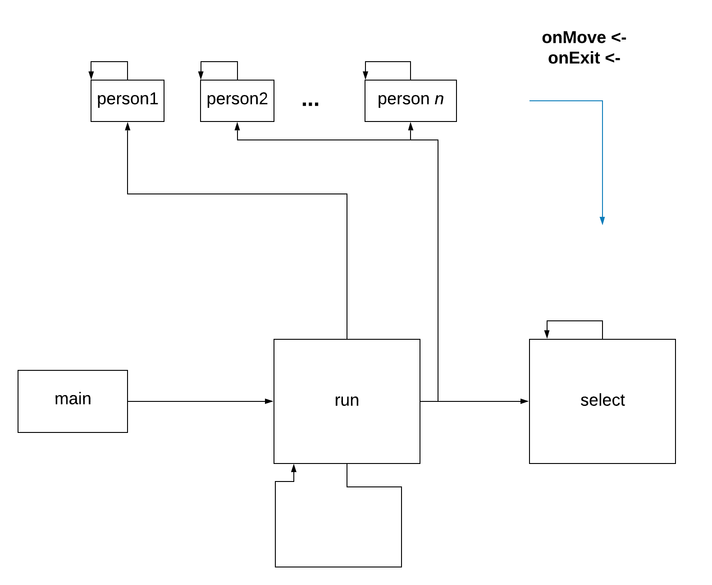

# Threads
- main thread executes the run method
- the run method executes each person's goroutine
- the run method executes the select statement within an anonimous goroutine
- each person communicates through the `onMove` and `onExit` channels to the select statement
- the run method keeps executing an update method to re-render the canvas

# Libraries
* built-in
  * bufio
  * fmt
  * math
  * math/rand
  * os
  * strconv
  * strconv
  * strings
  * time
* installed
  * [pixel](https://github.com/faiface/pixel)
    * pixel/imdraw
    * pixel/pixelgl
    * pixel/text
  * [colornames](https://godoc.org/golang.org/x/image/colornames)
  * [font/basicfont](https://godoc.org/golang.org/x/image/font/basicfont)
# Structs
* coordinate
  * row (int): x coordinate, or row number
  * col (int): y coordinate, or column number
* person
  * id (int): person's id
  * peed (float32): person's slowness, the bigger the slower
  * exited (bool): wheter a person has reached the exit or not
  * path ([]coordinate): the path to the exit represented as an array of coordinates
  * position (int): number of places moved from the starting point
  * curr_position (coordinate): current coordinate where person is
# METHODS
* initializePast()
* printBuilding()
* printPast()
* printPathMatrix()
* getNumOfPeople()
* generateExits(floor [][]int)
  * Function that receives building matrix, and randomly generates a random number of exits on its borders
  * Parameters
    * floor ([][]int): matrix that represents the map of the building
* insertExit(floor [][]int, sideExits []int, side int, indexExit int, lenF int) bool
  * Function that inserts an exit on a random position of the border of the matrix
  * Parameters
    * floor ([][]int): matrix that represents the map of the building
    * sideExits ([]int): an array that has a counter of exits for each border
    * side (int): the border where the exit is going to be inserted (0 up, 1 right, 2 down, 3 left)
    * indexExit (int): the index where the exit is going to be inserted
    * lenF (int): The length of the side of the matrix
  * Returns
    * bool: returns true if the exit was inserted, returns false if it was not
* distance(a coordinate, b coordinate) float64
* findClosestExit(position coordinate) int
* validate(row int, col int) bool
* searchPath(row int, col int) bool
* createWindow() \*pixelgl.Window
* drawFloor(win \*pixelgl.Window) \*imdraw.IMDraw
* drawPeople(win \*pixelgl.Window) \*imdraw.IMDraw
* printLabels(win \*pixelgl.Window)
* run()
* movePerson(p person)
  * Moves a person to its next position on its path atribute
  * Paratemters
    * p (person): The person that is going to be moved
* generateRandomSpeed() float32
* initiatePerson(p person, onMove chan person, onExit chan person, trapped []person)
* main()
